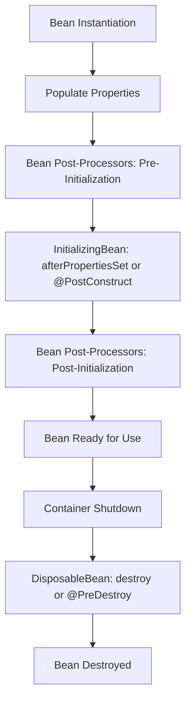

# The Spring Bean Lifecycle

## Lifecycle annotations
- @PostConstruct: This annotation marks a method to be executed after the bean's properties have been set and prior to
  its use.
- @PreDestroy: This annotation marks a method to be executed just before the bean is destroyed, typically during
  container shutdown.

## Bean Post Processors

## 'Aware' Interfaces
*Rarely used by Spring developers*

### Spring 'Aware' Interfaces

| Interface                        | Description                                                                                          |
|----------------------------------|------------------------------------------------------------------------------------------------------|
| `ApplicationContextAware`        | Allows a bean to access the `ApplicationContext` that it is defined in.                              |
| `BeanFactoryAware`               | Provides access to the `BeanFactory` that created the bean.                                          |
| `MessageSourceAware`             | Allows a bean to access the `MessageSource` for resolving messages, supporting internationalization. |
| `ResourceLoaderAware`            | Enables a bean to access the `ResourceLoader` for resource loading functionality.                    |
| `ServletContextAware`            | Provides access to the `ServletContext` in a web application context.                                |
| `EnvironmentAware`               | Allows a bean to access the `Environment` and its properties/configurations.                         |
| `ApplicationEventPublisherAware` | Enables a bean to publish application events.                                                        |
| `BeanNameAware`                  | Provides access to the name of the bean as defined in the Spring container.                          |
